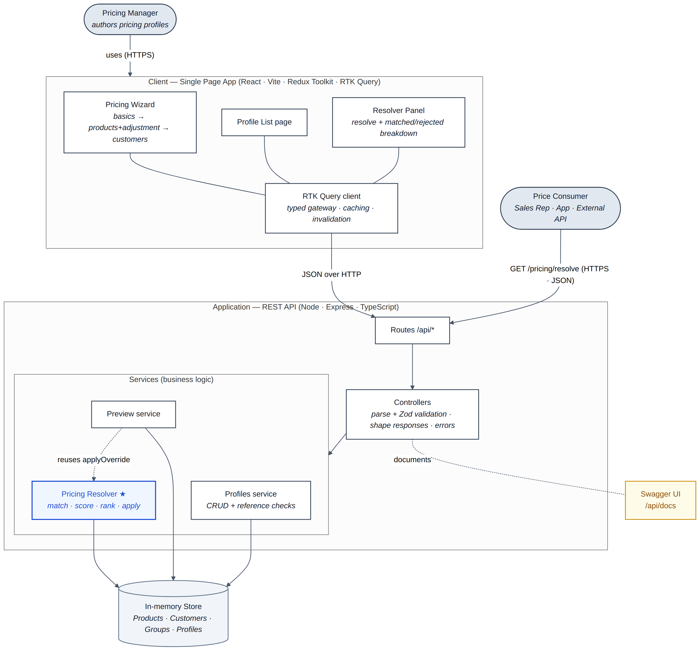
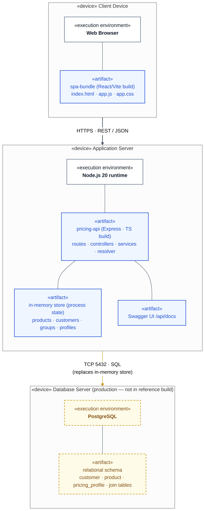

# High-Level Design (HLD)

> **What this is.** The *shape* of the FOBOH Pricing system — what it is, how its
> parts fit together, and how it is deployed. For the internals (types, the
> resolver algorithm, the API), see [`../low-level-design`](../low-level-design).

---

## 1. What the system solves

FOBOH is a wholesale food-and-beverage marketplace. Suppliers don't sell at one
flat price — they negotiate **bespoke prices** with different customers and
customer groups. The system lets a pricing manager **author these deals as
reusable “pricing profiles”** and lets any caller **resolve** a final price for
any `(customer, product)` pair — always with a clear reason why.

| Workflow | Who | Outcome |
|---|---|---|
| **Authoring** | Pricing Manager | A stored pricing profile (3-step wizard, live preview, save Draft / Activate) |
| **Resolving** | Sales rep · app · external API | One final price + a full matched/rejected audit trail |

---

## 2. System architecture

A layered, one-direction-of-dependency design: **routes → controllers →
services → store**. Controllers hold no business rules; services never parse
HTTP. The resolver is a **pure service over the store**, so it can be unit-tested
in isolation and later moved behind a database without touching the API contract.

- **Client (SPA)** — React + Vite + Redux Toolkit. The Pricing Wizard, Profile
  List, and Resolver Panel all talk to the backend through a single typed
  **RTK Query** client that caches reads and invalidates them on writes.
- **Application (REST API)** — Express + TypeScript. Routes map URLs to
  controllers; controllers validate input (Zod) and shape responses; services
  carry the business logic. The **Pricing Resolver ★** is the core engine; the
  Preview service reuses the resolver's `applyOverride` so previews and resolves
  can never disagree on the maths.
- **Store** — an in-memory store seeded at startup (Products, Customers, Groups,
  Profiles). Swagger UI is served at `/api/docs`.

---

## 3. The pricing model — three independent dimensions

A pricing profile is *“who gets which products at what adjustment”*:

| Dimension | Field | Options |
|---|---|---|
| **WHO** | `customerScope` | a specific **Customer** · a **Group** · **All** customers |
| **WHICH** | `productScope` | a product **list** · an attribute **Rule** (segment/brand/sub-category) · **All** |
| **HOW MUCH** | `priceOverride` | an **Adjustment** (fixed $ or %, up/down) · a flat **Custom price** |

Plus a `status` (ACTIVE / DRAFT) and an `updatedAt` used to break ties.

---

## 4. Guiding principle: specificity wins, customer-first

When several active profiles match the same `(customer, product)` pair, the
resolver picks the **most specific** one — judged **customer-first, then
product**:

| Priority | Customer scope | Beats | Why |
|---|---|---|---|
| Highest | Specific **Customer** | Group | “We agreed this price *with you*” is the strongest promise |
| Middle | **Group** | All | A group deal is more intentional than a blanket rule |
| Lowest | **All** | — | The catch-all baseline |

Within the same customer level, product **List → Rule → All**. Still tied? The
**most recently updated** profile wins. No match at all → the product's **base
price**. (The exact algorithm and worked numbers are in the LLD.)

---

## 5. Deployment

The reference build runs as a **single Node process** with an in-memory store —
fast to run and demo. The diagram also shows the **production** shape (a separate
PostgreSQL node, dashed) that the store is designed to be swapped for without
touching the resolver or API contract.

| Path | Protocol |
|---|---|
| Client Device → Application Server | HTTPS · REST / JSON |
| Application Server → Database Server *(production)* | TCP 5432 · SQL (replaces the in-memory store) |

---

## 6. Key design decisions

| Decision | Choice | Why it matters to the business |
|---|---|---|
| Precedence | Customer beats product specificity | Matches how a rep defends a price |
| Tie-break | Most recently updated wins | Newest deal supersedes older ones; explainable |
| “All products” | Wizard saves a **snapshot**; API also accepts a **dynamic** “all” rule | Snapshots are auditable; dynamic rules auto-cover new SKUs |
| Deleted products | Soft delete; skipped silently by the resolver | Preserves history; reinstated SKU keeps old deals |
| Negative prices | Clamped to **$0.00**, flagged | A “200% off” deal is legal intent — customer pays $0 |
| Rounding | Half-up to 2 dp | Matches retail intuition ($0.125 → $0.13) |
| Storage | In-memory for this build | Fast to run; production shape shown above |

**Quality attributes:** explainability is first-class (every resolve returns the
full matched/rejected breakdown), determinism (a final id-based tie-break),
type-safety end to end (TypeScript + Zod), and clean separation of concerns.

**Known limitations (intentional):** in-memory store resets on restart; the
wizard collapses a multi-customer selection to one `CUSTOMER` scope; no
effective-dating yet; the per-call breakdown isn't persisted.

---

## Diagram sources

Editable sources live in [`../source-files`](../source-files):
`architecture.drawio` (open in [draw.io](https://app.diagrams.net)).
Re-export to PNG after editing to keep this folder in sync.
