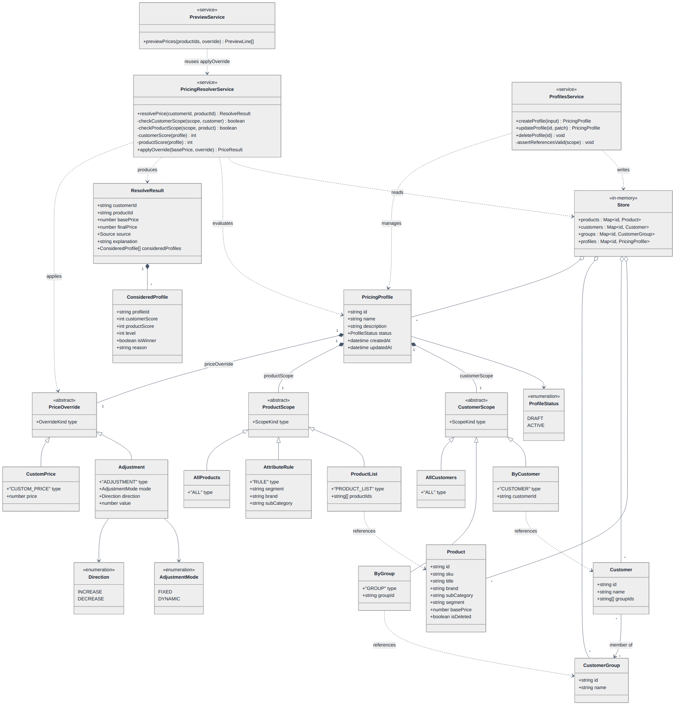
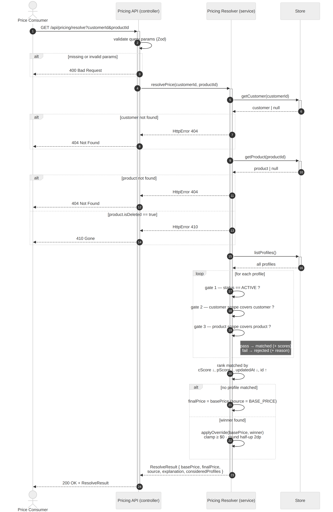
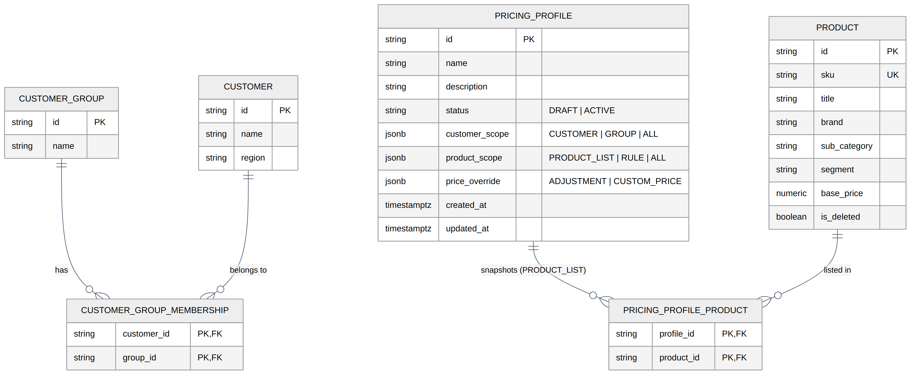

# Low-Level Design (LLD)

> **What this is.** How the FOBOH Pricing system works *internally* — the domain
> model, the resolve flow, the database schema, and the price-resolver algorithm
> in full, including every edge case. For the big picture see
> [`../high-level-design`](../high-level-design).

---

## 1. Domain model (class diagram)

The pricing model is three discriminated unions (`CustomerScope`,
`ProductScope`, `PriceOverride`) composed into a `PricingProfile`. Services are
pure logic over an in-memory `Store`; the resolver produces a `ResolveResult`
that carries the full audit trail (`consideredProfiles`).



- **PricingProfile** composes exactly one of each scope/override (filled diamond
  = composition). `status` is `DRAFT | ACTIVE`; `updatedAt` is the tie-breaker.
- **CustomerScope / ProductScope / PriceOverride** are abstract with concrete
  variants (inheritance) — the `type` discriminator selects the variant.
- **PricingResolverService** reads the store, evaluates every profile, and
  produces a `ResolveResult`. **PreviewService** reuses its `applyOverride`.
- **Store** aggregates Products, Customers, Groups, and Profiles.

---

## 2. The resolve flow (sequence diagram)

`GET /api/pricing/resolve?customerId&productId` → controller validates →
resolver loads, matches, ranks, applies → result returned with the breakdown.



> The diagram shows every guard (`400` invalid params, `404` missing
> customer/product, `410` deleted product), the per-profile matching loop, the
> ranking step, and the base-price-vs-winner branch.

---

## 3. Database schema (ER diagram)

The production-normalized shape. The reference build keeps these tables
**in-memory**; the customer↔group link is an array there, modelled here as a
proper join table. Scope/override objects are stored as `jsonb` so the rule
shapes stay flexible.



| Table | Notes |
|---|---|
| `customer`, `customer_group` | Reference data |
| `customer_group_membership` | Join table (composite PK) for the many-to-many |
| `product` | Carries `is_deleted` (soft delete) and the attributes rules filter on |
| `pricing_profile` | `customer_scope` / `product_scope` / `price_override` as `jsonb`; `status`; `updated_at` |
| `pricing_profile_product` | Snapshot of a `PRODUCT_LIST` scope |

Recommended index: `(status, updated_at)` so the resolver scans only active
profiles in tie-break order.

---

## 4. The price-resolver algorithm — `resolvePrice(customerId, productId)`

Five phases.

**Phase 1 — Load & guard.** Load the customer (`404` if missing) and product
(`404` if missing, `410` if soft-deleted).

**Phase 2 — Match each profile (three gates).** Loop every profile; each failure
records a human-readable reason.

1. **Status** — must be `ACTIVE` (DRAFT never wins).
2. **Customer scope** — `ALL` → match · `CUSTOMER` → id equal · `GROUP` →
   customer's `groupIds` includes the group.
3. **Product scope** — `ALL` → match · `PRODUCT_LIST` → id in list · `RULE` →
   **every** supplied filter equals the product's attribute (**AND** logic).

Passers go to **matched** (with scores); failers to **rejected** (with reason).

**Phase 3 — Score & rank.**

| `customerScope` | score | | `productScope` | score |
|---|---|---|---|---|
| `CUSTOMER` | 3 | | `PRODUCT_LIST` | 3 |
| `GROUP` | 2 | | `RULE` | 2 |
| `ALL` | 1 | | `ALL` | 1 |

```ts
matched.sort((a, b) =>
     (b.cScore - a.cScore)                                // 1. customer-specificity ↓
  || (b.pScore - a.pScore)                                // 2. product-specificity ↓
  || (Date.parse(b.updatedAt) - Date.parse(a.updatedAt))  // 3. most recently updated
  || a.id.localeCompare(b.id));                           // 4. deterministic tie-break
```

**Phase 4 — Apply the winner's rule (`applyOverride`).**

```ts
if (override.type === 'CUSTOM_PRICE') raw = override.price;
else {
  const delta = mode === 'FIXED' ? value : (basePrice * value) / 100;
  raw = direction === 'INCREASE' ? basePrice + delta : basePrice - delta;
}
const clamped = raw < 0;
const price   = round2(Math.max(raw, 0));   // clamp to 0, then half-up to 2dp
```

**Phase 5 — Build result.** Returns `basePrice`, `finalPrice`, a `source`
(`BASE_PRICE` or the winning `PROFILE` + level/label), a one-line `explanation`,
and the full `consideredProfiles`. Empty matched → `source = BASE_PRICE`.

---

## 5. Worked examples (verified against the engine)

Seed world: **Bondi** is in *Independent + VIP*; **Paddington** in *Independent*;
**ARIA** in *VIP + On-Premise*. Profiles: **A** = Independent −10% Wine (01 Jan),
**B** = VIP −$15 Sparkling (02 Jan), **C** = Bondi/Koyama custom $95 (03 Jan).

| Customer → Product (base) | What happens | Final |
|---|---|---|
| Bondi → Koyama Brut ($120) | A,B,C all match; **C** scores (3,3) — customer beats all | **$95.00** |
| Bondi → Lacourte ($409.32) | A,B tie (2,2); **B** newer (02>01 Jan) | **$394.32** |
| Bondi → High Garden Pinot ($279.06) | B needs Sparkling (it's Red), C not Koyama; **A** only | **$251.15** |
| ARIA → Koyama Brut ($120) | not Independent → A out; **B** only | **$105.00** |
| Paddington → Lacourte ($409.32) | not VIP → B out; **A** only | **$368.39** |
| Bondi → Necessaire Vermouth ($58) | a Spirit — no wine profile matches | **$58.00** (base) |

> Note Bondi → Koyama is **$95**, *not* the cheaper $105 (B) — the resolver picks
> the most **specific** profile, not the lowest price.

---

## 6. Edge cases

| Situation | Behaviour |
|---|---|
| No profile matches | Base price (`source = BASE_PRICE`) |
| Customer deal worse than a product deal | Customer deal **still wins** (specificity, not cheapness) |
| Tie on specificity | **Most recently updated** wins |
| Product soft-deleted | Resolving it → **410**; inside another profile's list → silently skipped |
| Profile is DRAFT | Never considered |
| Adjustment drives price < 0 | **Clamped to $0.00**, flagged |
| Rounding | **Half-up** to the cent ($0.125 → $0.13) |
| RULE with several filters | Product must satisfy **all** (AND, not OR) |
| Customer in multiple groups | Can match several group deals; ranking picks one |
| Customer / product missing | **Not-found** error, not a price |
| “All products” snapshot vs dynamic | Wizard freezes a list; API “ALL” rule covers future SKUs |
| Custom price vs adjustment | Custom ignores base; adjustment computes from base |

---

## 7. Validation, API & extension points

**Validation (Zod, at the controller boundary):** all objects `.strict()`;
`adjustment.value` ≥ 0 and 0–100 if `DYNAMIC`; scopes/overrides are discriminated
unions; `RULE` ≥ 1 filter; `PRODUCT_LIST` ≥ 1 id; `CUSTOM_PRICE.price` ≥ 0.
Failure → `400` with field-level errors.

**Resolve endpoint:** `GET /api/pricing/resolve?customerId&productId` →
`200 ResolveResult` · `400` (params) · `404` (customer/product) · `410` (deleted).
Full API surface and CRUD endpoints are documented in Swagger at `/api/docs`.

**Extension points:** change the `matched.sort` comparator to adjust precedence ·
add a price-rule type via `PriceOverride` + schema + `applyOverride` · add a scope
dimension via the scope types + Zod + `check*Scope` + score fns · add
effective-dating as a Phase-2 gate · swap the store for a DB by reimplementing
`store/index.ts` (the resolver is untouched).

---

## Diagram sources

Editable sources in [`../source-files`](../source-files):
`db-schema.drawio` (database schema, [draw.io](https://app.diagrams.net)) and
`sequence.mmd` (resolve flow, [Mermaid](https://mermaid.js.org) — renders on
GitHub and via `mmdc`). All diagrams here were authored in Mermaid / draw.io and
exported to PNG; edit the source and re-export to keep this folder in sync.
